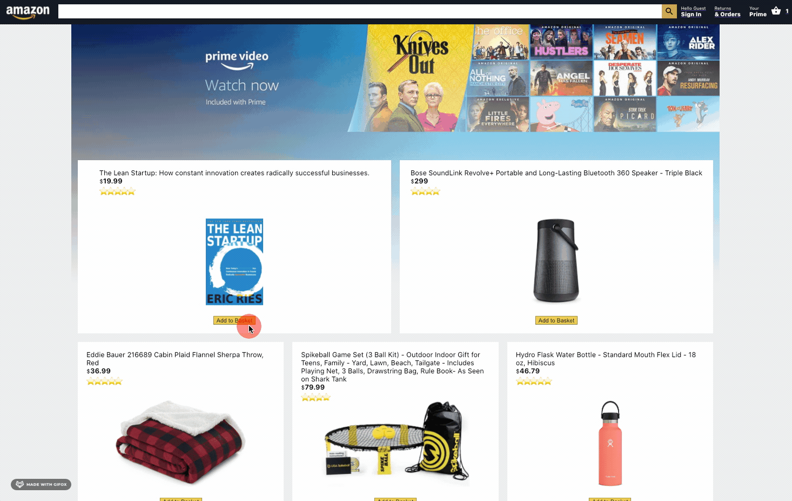
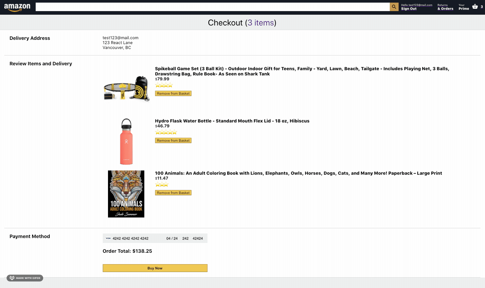
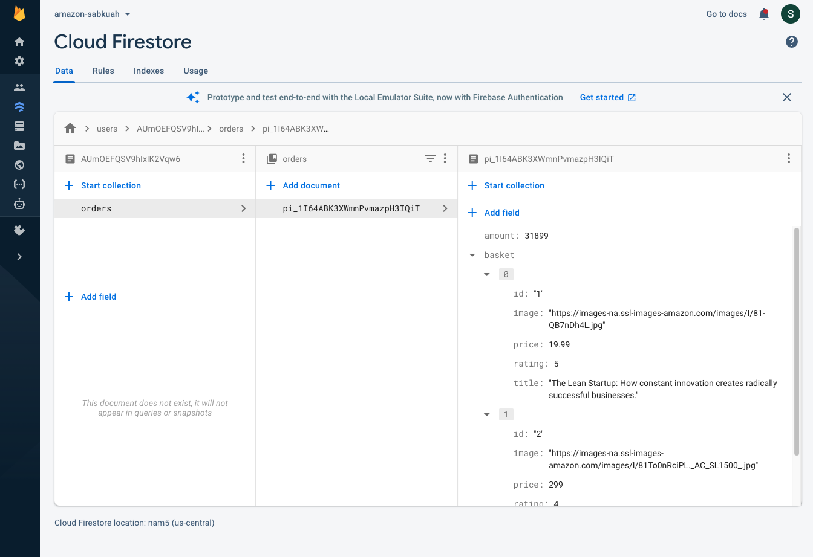
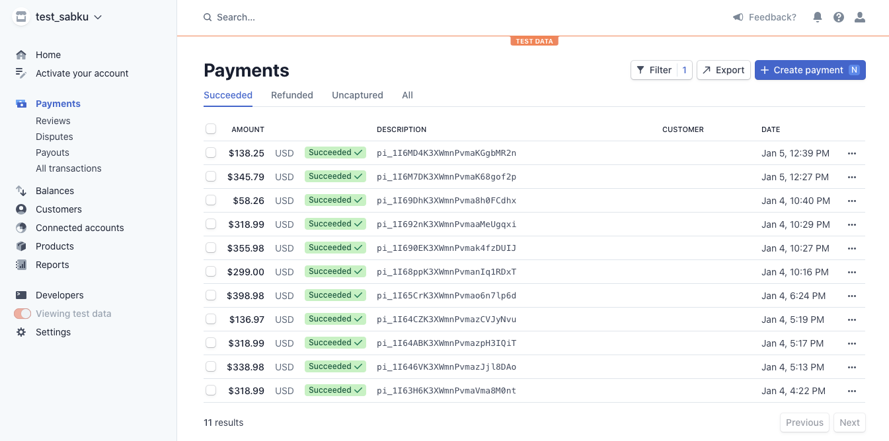

# Amazon Clone - project by Sabkuah

## Live @ https://sabkuah-961f5.web.app

### Project Features: 
- user authentication with Firebase
- Stripe payment processing
- Cloud functions with FireStore
- BEM naming conventions for styling
- ES6 Javascript, Hooks, React Context

### Demos

Add/Delete items to cart, user authentication:

Checkout with Stripe payment, user's order history in descending order:

Log of Stripe payments processed:

Cloud Firestore database of order history:

### Libraries

- Material UI icons
- SASS
- React Router Dom
- react-currency-format
- Firebase & Firestore
- Stripe
- Axios
- Express
- Moment
